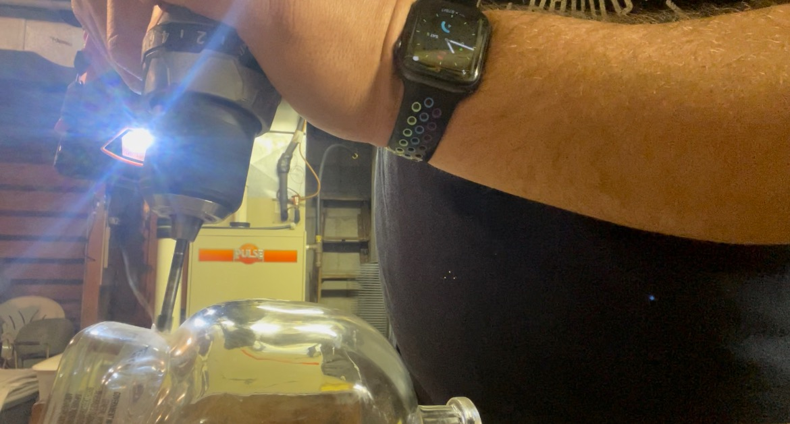
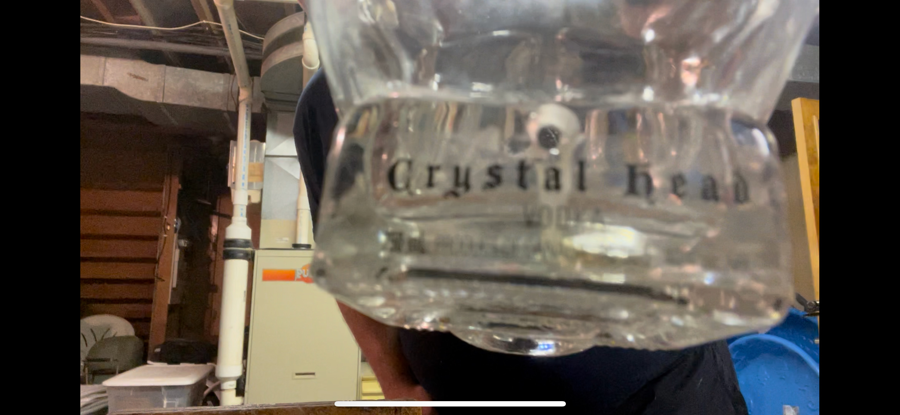

# canada-day-skull
Overview and python code for my "Canada Day" skull party light / drinking game


# Origin story
So my buddy has a "Canada Day" party every year. Everything at the party is somehow tied to Canada. It's a fun time, kind of an exercise in absurdity, and something I look forward to every year. As "everything has to be Canadian," and I'm a vodka drinker, my friend went through the time, effort and energy of finding a Canadian vodka. Turns out that ["Crystal Head" vodka](https://www.crystalheadvodka.com/ourstory) is exported by Canada, and further... fronted by famous Canadian Comedian Dan Aykroyd. As an extra bonus, it comes in a cool looking skull-shaped bottle.

Over the years we've collectively emptied several of these bottles, and the host of the party decided to use them as trophies / decorations. One year, they added some stranded LED lights and the skulls appeared to glow. Cool table decorations (as the party usually rages on into the evening), but as I held one... I thought, "I can do this better I think."


It was about a year an a half ago when I was in a bar and asked for Crystal Head vodka and I proceeded to drink the last the bar had. They gave me the skull as a "thank you," and that's when I decided that fate had given me a kick in the pants to execute on the project...


# Construction
I knew it was going to be a daunting task. I had only a few requirements, but they were important to me. 

* Use "smart" LEDs that could be animated
* Use the colors of the Canadian flag (red and white)
* Protect the circuit from the normal "bumps and brusies" that happen when people start drinking

Armed with some small electronics from [adafruit](https://www.adafruit.com/) and some resin from [Resin Obsession](https://shop.resinobsession.com/) I set out to light the skull...

### The circuit
I used an [adafruit trinket](https://www.adafruit.com/product/3500), some [neopixels](https://www.adafruit.com/product/3851) and silicone shielded wire. The schematic is pretty simple. The board and the LED strip are powered directly from the battery, A signal wire (blue) from pin 3 to the signal on the LED strip, and a signal wire from the touch capacitive port (1~) on the board:


### The scaffolding
I created a wire "spiral" to put into the bottle out of 12GA shielded copper wire. It was on that that I took the LED strip and wond it around the spiral. I did "both sides" and used double sided tape to make sure the LED strip stayed on the scaffolding.


After that, the next problem to solve was getting power to the board / lights

 

### The Resin
Finally, I wanted to protect everything from rattling around in the skull and decided that "resin" would be a good fit for that purpose. I settled on [Resin Obsession deep pour resin](https://shop.resinobsession.com/collections/resin/resin-obsession-deep-pour-resin) because my total volume was 750ml and 6" deep. This was my first experience with resin (although I had been interested in it for a while) and I found this particular product very easy to work with. It was a simple 2:1 mixture and then pour. 

 

A bit of a warning... I did NOT do a great job of sealing the hole at the bottom of the skull, so there was a little bit of seepage. The "good news" is that once the resin cured half way (36 hours or so), the hole was plugged, and I was able to clean up the spill with acetone. 

# The software
I settled on [circuit python](https://circuitpython.org/) for the software. It's easy to write, test, and deploy. Everything boils down to a main loop that executes ~6 times per second. This is important to note because you want to write your functions in a way that works with the timing. For example, your function should only "move" the lights one step every time the loop executes. If you have your function do more than one step at a time, you will never be able to interrupt the animation until it finishes:

```
def redPulse():
    aPixel = neopixels[0]
    rCur = aPixel[0]
    gCur = aPixel[1]
    bCur = aPixel[2]

    if DIRECTION == 1:
        neopixels.fill((rCur + 10, gCur, bCur))

    if DIRECTION == 2:
        neopixels.fill((rCur - 10, gCur, bCur))
```

# The results
So github / markdown doesn't really do video embedding, so I made a quick video and pushed it up to youtube. You can view it [here.](https://youtu.be/npWIqatQBV4)