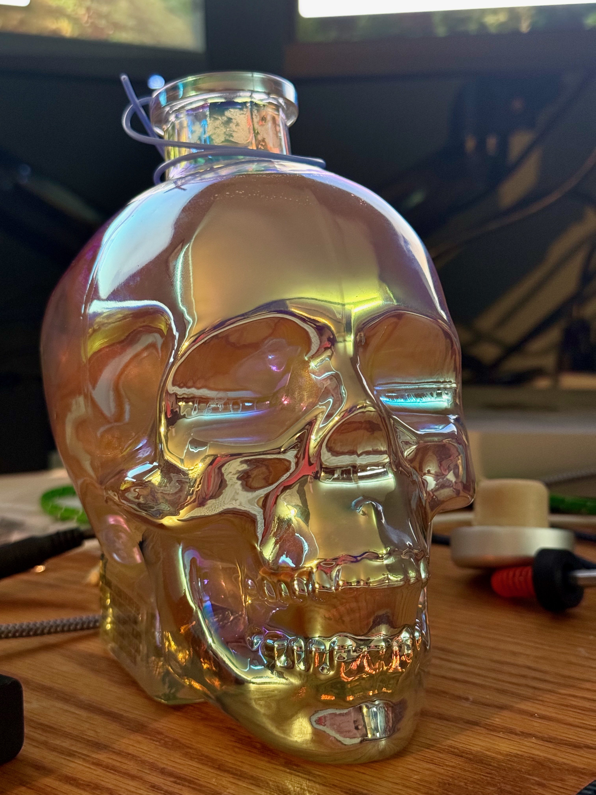
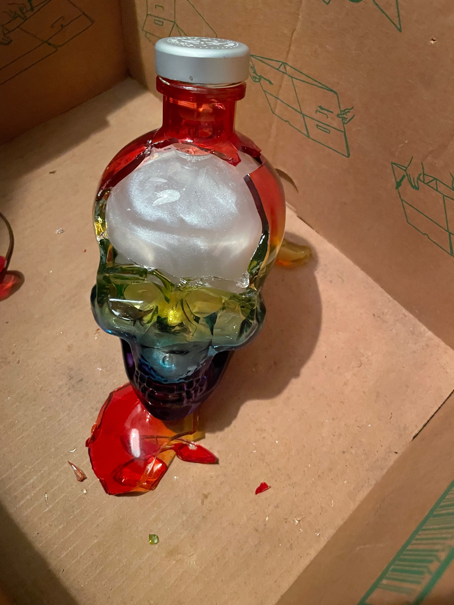
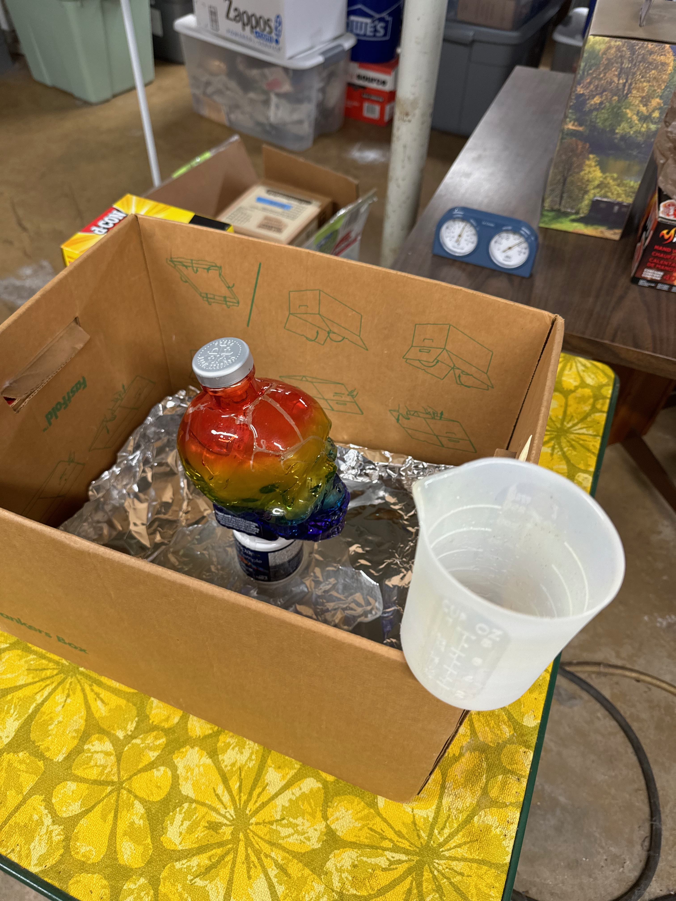
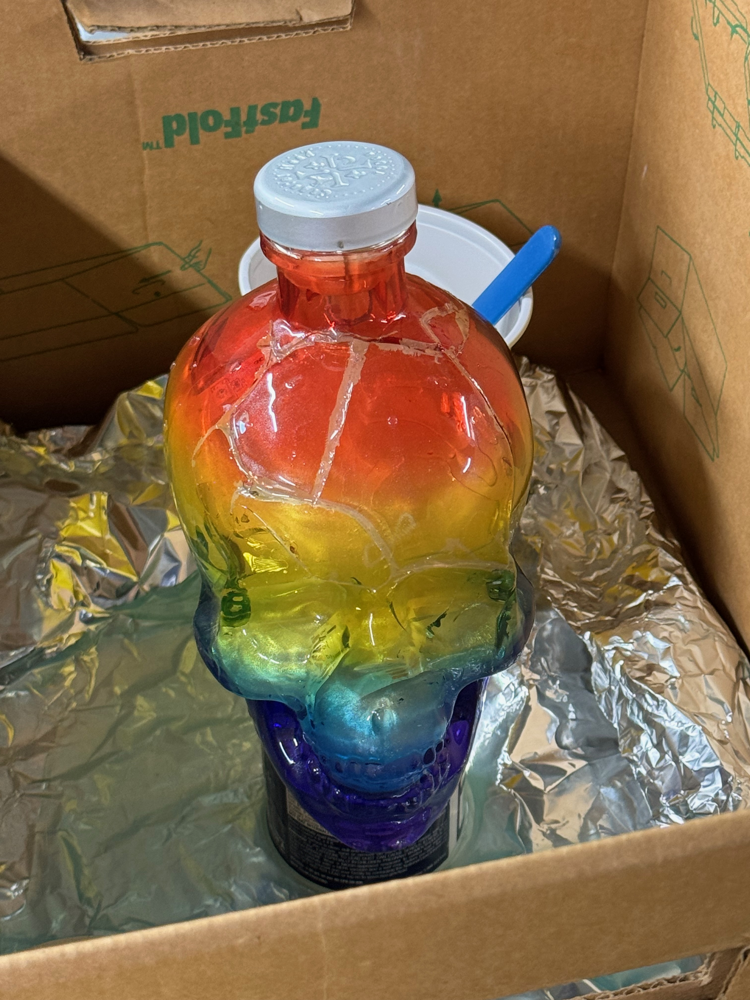

# CANADA DAY SKULL - TERMINATOR EDITION!!


# Origin story
So if you've gotten around to this release, you likely know that this project was started because of my buddy and his Canada Day party. If you're not familliar with the origin story, I highly suggest checking out [the original.](https://github.com/icejester/canada-day-skull/tree/cds-v1.0.0)

After taking in the origin story, I'd encourage you to check out "V2" which is also known as [the Pride Skull.](https://github.com/icejester/canada-day-skull/tree/cds-v2.0.0)

# Into each life, a little rain must fall



Unfortunately... shortly after my own summer party, the Pride Skull mysteriously shattered. There was no rhyme or reason to it. I walked into my office one day, and the front of the skull had popped off and there were several other cracks in the skull bottle, but the resin stayed in tact. All of the electrical components were in tact and functional. This was totally repairable with a little time, effort, and energy. 

# Construction

I honestly dragged my feet a bit this year and the fact that I also wanted to repair the pride skull left me little to no time to really do anything new for construction. I set myself to the task of repairing the pride skull. 

### Repair

  

I used a dremel to sand down the edges of the broken glass then used E-6000 to glue them back in place. I had originally planned to shave the glass pieces down enough to fill the resulting gaps with tile grout, but I couldn't seem to take enough off the pieces. Without at least 1/6th of an inch, I couldn't use the grout, I was stuck. I got the idea of trying to pour resin into the cracks hoping it would work similar to grout. The resin was WAY too thin immediately after stirring. After the fitst pour, I noticed the resin was just running off the sidesof the skull. I then decided to apply several coats of resin and eventually the cracks filled in.

### Physical build: If it ain't broke... don't fix it 


I didn't put a lot of time, effort or energy into modifying the physical build. I have some ideas floating around, but I'd want to save them for a future build. In either case, I had this cool mirrored skull bottle to work with. 


The second I connected the battery to the lights I knew that the mirrored glass would add a really cool effect. I thought the additional levels of reflection, diffusion, and discoloration would really pay off in the final implementation.

  

Every time I talk to people about the skull, I tell them that the hardest thing about the project is drilling the hole in the bottle. I feel like Im getting better at it, but still experimenting with "better." This year I attempted to use a dremel and a sanding / polishing tip to smooth out the hole. It did not, rather the I broke the tip off in the existing hole. I eventually pulled out the tip with a needle nosed pliars. 


With all that out of the way, I was ready to start the resin...

# The Resin

# The software
I didn't do a whole lot different this time with exception to what I'm calling the blinkFade method. I wanted something that would look like randomly starting lights that faded away over time. I think this was a pretty succinct way to get that done.

```
def blinkFade():
    # print("blinking")
    currentLitPixels = 0
    # count total lit pixels
    for p in range(NUMPIXELS):
        aPixel = neopixels[p]
        if aPixel[0] > 10:
            rCur = aPixel[0]
            gCur = aPixel[1]
            bCur = aPixel[2]
            
            neopixels[p] = ((rCur - 10, gCur - 10, bCur - 10))
            currentLitPixels += 1
    
    # if the number of lit pixels is less than max lit pixels
    if currentLitPixels < 15:
        neopixels[random.randint(0,29)] = (250, 250, 250)
```