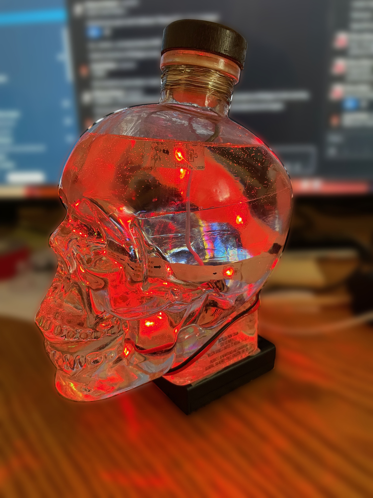
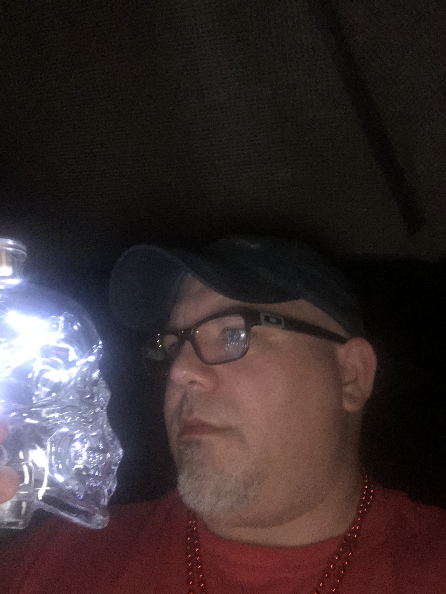

# canada-day-skull
Overview and python code for my "Canada Day" skull party light / drinking game

# Origin story
So my buddy has a "Canada Day" party every year. Everything at the party is somehow tied to Canada. It's a fun time, kind of an exercise in absurdity, and something I look forward to every year. As "everything has to be Canadian," and I'm a vodka drinker, my fried went through the time, effort and energy of finding a Canadian vodka. Turns out that ["Crystal Head" vodka](https://www.crystalheadvodka.com/ourstory) is exported by Canada, and further... fronted by famous Canadian Comedian Dan Aykroyd. As an extra bonus, it comes in a cool looking skull-shaped bottle.

Over the years we've collectively emptied several of these bottles, and the host of the party decided to use them as trophies / decorations. One year, they added some stranded LED lights and the skulls appeared to glow. Cool table decorations (as the party usually rages on into the evening), but as I held one... I thought, "I can do this better I think."

