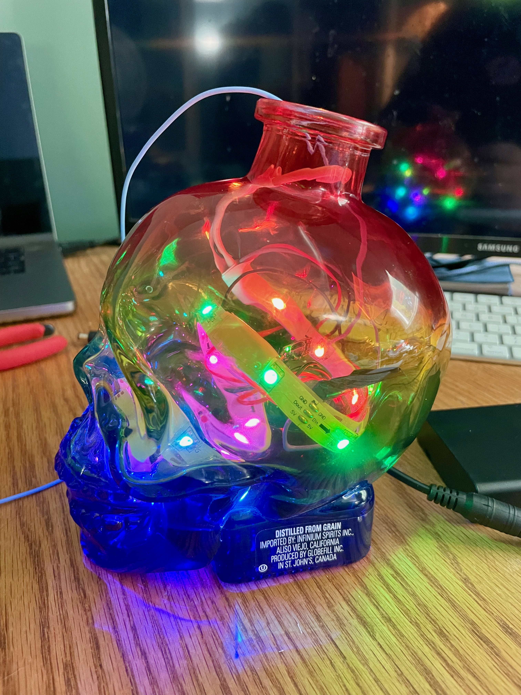
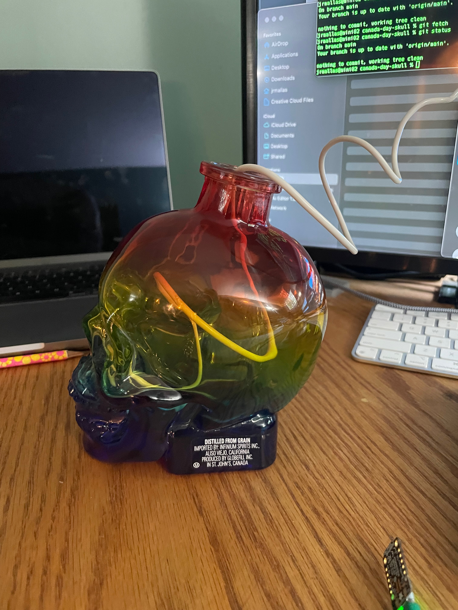
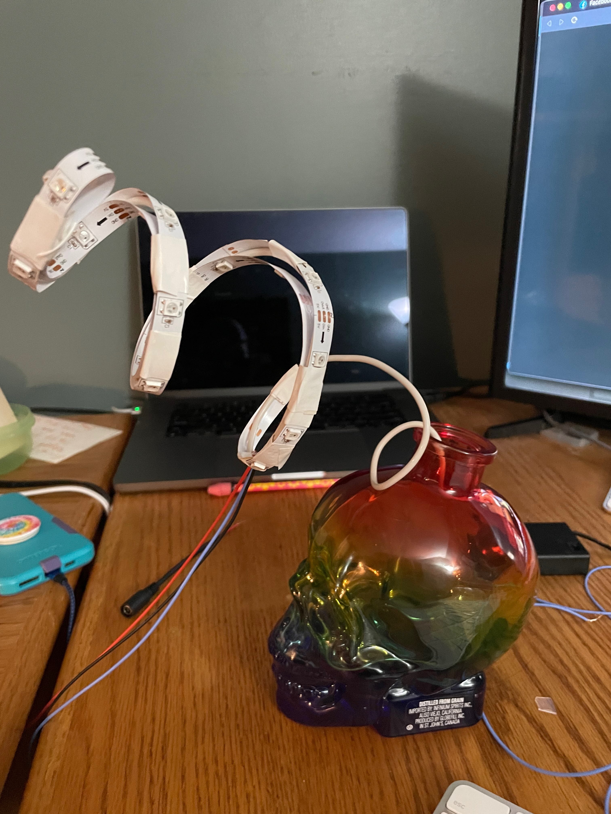
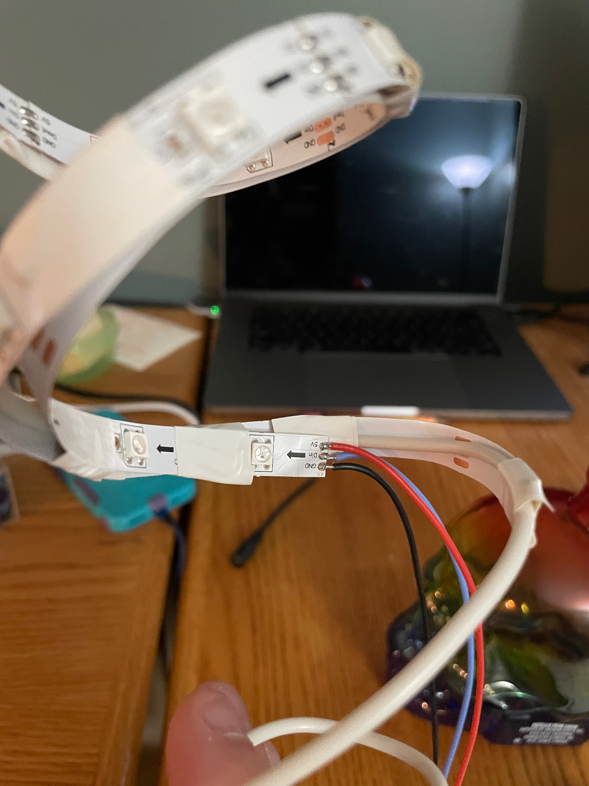
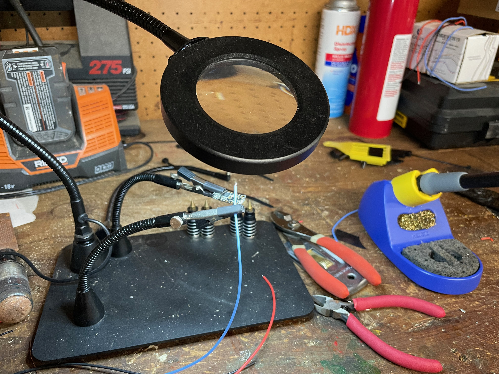
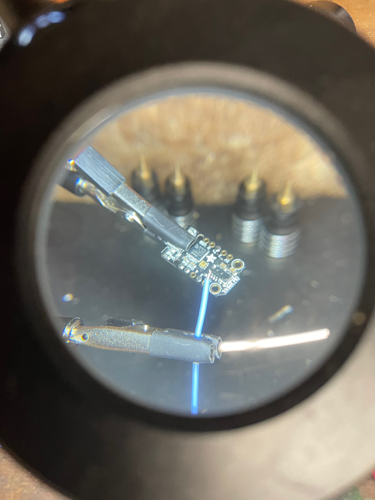
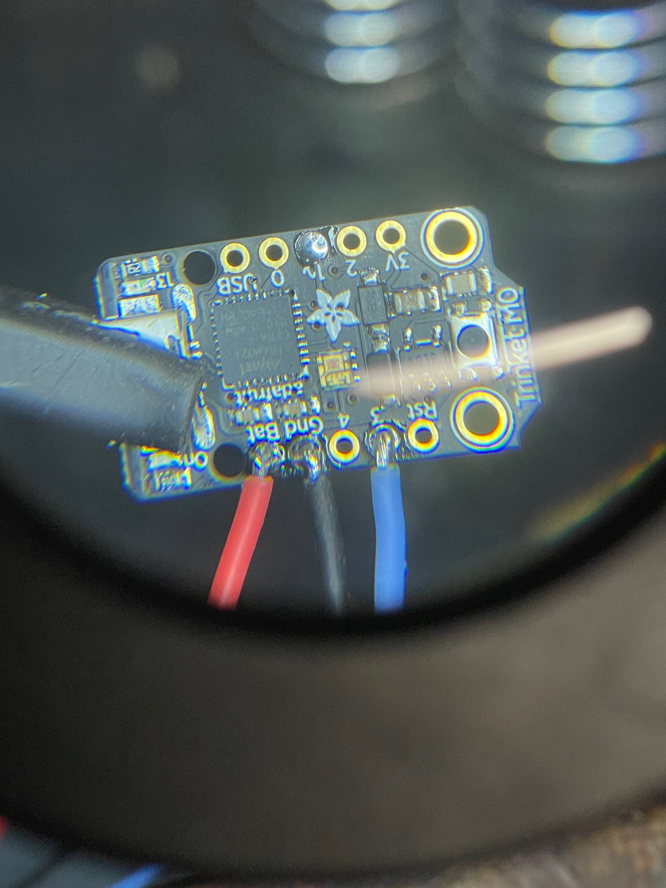
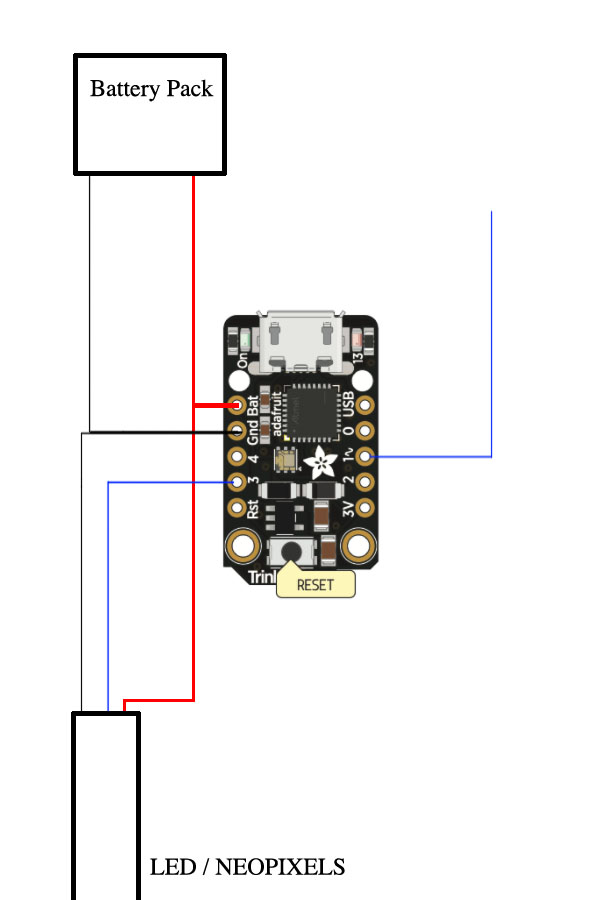
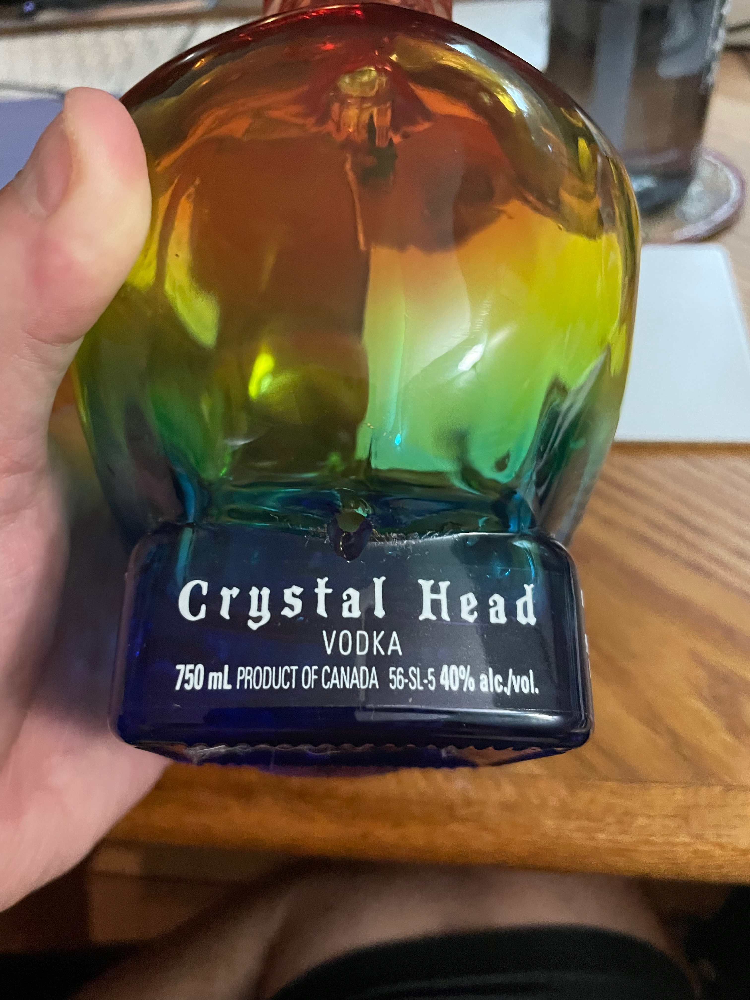
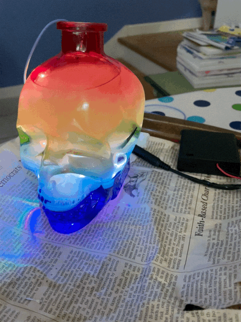

# PRIDE SKULL!


# Origin story
So if you've gotten around to this release, you likely know that this project was started because of my buddy and his Canada Day party. If you're not familliar with the origin story, I highly suggest checking out [the original.](https://github.com/icejester/canada-day-skull/tree/cds-v1.0.0)

# Time marches on
I've made a few of these skulls since the first one. I wanted one of my own so on Canada Day 2022, I walked out of the Canada Day party with a skull of my very own. As fate would have it, it was one of the ["Made With Pride"](https://www.crystalheadvodka.com/news/made-with-pride) skull bottles, which I thought was pretty cool.   

# Construction

I wanted to focus more on documenting the construction process this time around. I missed several aspects the first time, so I'd like to focus on them here.

### Scaffolding 

  

One of the things I wanted to improve on with the first iteration was how the loose LEDs in the jar would "clump up" and the skull would have light and dark spots. I wanted the lights to be spread out over the entire volume. I settled on a piece of ridgid copper shielded wite (12 GA) formed into a spiral. The first iteration I used double sided tape to secure the LEDs to the scaffolding. I've used several variations of electrical tape and even hockey tape.

### Soldering:

I really enjoy soldering and as such, bought myself a nice work station with a lighted magnifier. I can not tell you how much "proper tooling" has improved my soldering ability. If you love these kind of hibbies, spend the money. It'll be worth it. 

  

### The circuit

I used an [adafruit trinket](https://www.adafruit.com/product/3500), some [neopixels](https://www.adafruit.com/product/3851) and silicone shielded wire. The schematic is pretty simple. The board and the LED strip are powered directly from the battery, A signal wire (blue) from pin 3 to the signal on the LED strip, and a signal wire from the touch capacitive port (1~) on the board:



### The hole... no, really

Of all the steps involved in this project, drilling the hole has the most risk and anxiety. I was quite happy with the hole drilling this time as I no longer had my "good vice" so I had to drill the skull "free hand."



### The Resin 
In years past I have always done "glass" resin to accent the internals. I even went so far as to do one in multiple pours with differnet colors. This year, my daughter suggested I "pearlize" the resin with mica powder. I took some pictures between pours to capture how well the pearlization disburses the light

  

# The software
I settled on [circuit python](https://circuitpython.org/) for the software. It's easy to write, test, and deploy. Everything boils down to a main loop that executes ~6 times per second. This is important to note because you want to write your functions in a way that works with the timing. For example, your function should only "move" the lights one step every time the loop executes. If you have your function do more than one step at a time, you will never be able to interrupt the animation until it finishes:

```
def redPulse():
    aPixel = neopixels[0]
    rCur = aPixel[0]
    gCur = aPixel[1]
    bCur = aPixel[2]

    if DIRECTION == 1:
        neopixels.fill((rCur + 10, gCur, bCur))

    if DIRECTION == 2:
        neopixels.fill((rCur - 10, gCur, bCur))
```

# The results
So github / markdown doesn't really do video embedding, so I made a quick video and pushed it up to youtube. You can view it [here.](https://youtu.be/npWIqatQBV4)