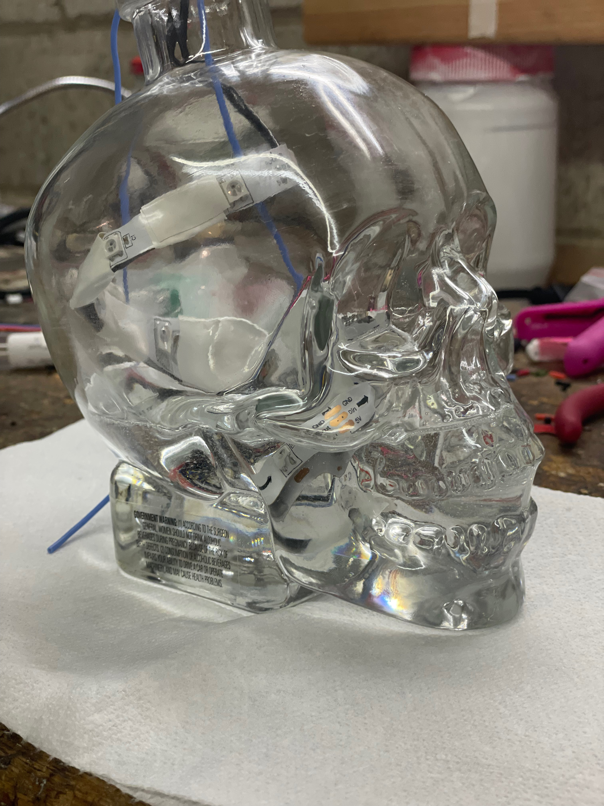

# PRIDE SKULL!


# Origin story
So if you've gotten around to this release, you likely know that this project was started because of my buddy and his Canada Day party. If you're not familliar with the origin story, I highly suggest checking out [the original.](https://github.com/icejester/canada-day-skull/tree/cds-v1.0.0)

# Time marches on
I've made a few of these skulls since the first one. I wanted one of my own so on Canada Day 2022, I walked out of the Canada Day party with a skull of my very own. As fate would have it, it was one of [the "Made With Pride"](https://www.crystalheadvodka.com/news/made-with-pride) bottles. Cool... More color, better.  

# Construction
### I wanted to focus more on documenting the construction process this time around. One of the things I missed the first time was showing the "scaffolding" for the LED strips: 


  

### As well as some of the soldering:

  

### The circuit
I used an [adafruit trinket](https://www.adafruit.com/product/3500), some [neopixels](https://www.adafruit.com/product/3851) and silicone shielded wire. The schematic is pretty simple. The board and the LED strip are powered directly from the battery, A signal wire (blue) from pin 3 to the signal on the LED strip, and a signal wire from the touch capacitive port (1~) on the board:

After that, the next problem to solve was getting power to the board / lights


### The Resin
Finally, I wanted to protect everything from rattling around in the skull and decided that "resin" would be a good fit for that purpose. I settled on [Resin Obsession deep pour resin](https://shop.resinobsession.com/collections/resin/resin-obsession-deep-pour-resin) because my total volume was 750ml and 6" deep. This was my first experience with resin (although I had been interested in it for a while) and I found this particular product very easy to work with. It was a simple 2:1 mixture and then pour. 

 

A bit of a warning... I did NOT do a great job of sealing the hole at the bottom of the skull, so there was a little bit of seepage. The "good news" is that once the resin cured half way (36 hours or so), the hole was plugged, and I was able to clean up the spill with acetone. 

# The software
I settled on [circuit python](https://circuitpython.org/) for the software. It's easy to write, test, and deploy. Everything boils down to a main loop that executes ~6 times per second. This is important to note because you want to write your functions in a way that works with the timing. For example, your function should only "move" the lights one step every time the loop executes. If you have your function do more than one step at a time, you will never be able to interrupt the animation until it finishes:

```
def redPulse():
    aPixel = neopixels[0]
    rCur = aPixel[0]
    gCur = aPixel[1]
    bCur = aPixel[2]

    if DIRECTION == 1:
        neopixels.fill((rCur + 10, gCur, bCur))

    if DIRECTION == 2:
        neopixels.fill((rCur - 10, gCur, bCur))
```

# The results
So github / markdown doesn't really do video embedding, so I made a quick video and pushed it up to youtube. You can view it [here.](https://youtu.be/npWIqatQBV4)